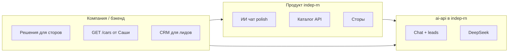

# Роудмап: мобильное приложение + ИИ-подбор

Обновлено с учётом текущего прогресса. Мобилка — **`indep-rn`**, бэкенд ИИ — папка **`ai-api/`** в том же репозитории. Чужой Laravel **не трогаем**.

---

## Сейчас сделано

| Область | Статус |
|---------|--------|
| ИИ-чат в приложении | Бургер-меню → «Подбор новых авто с ИИ», экран `/ai-picker` |
| Каталог для ИИ | ~248 моделей (`get-cars-to-banners`), seed-офлайн; **F-09** — единый `searchCatalog` (нормализация, скоринг, rules + LLM) |
| Логика без нейросети | Правила + карточки + заявка (телефон, dev-лог) |
| Сервер ИИ (скелет) | `ai-api/` — Hono, `POST /v1/chat`, `POST /v1/leads`, каталог с indep.su |
| Отчёты подборщика (UI) | Модалки медиа, фото повреждений (отдельная ветка) |
| Документация API каталога | `docs/BACKEND-CARS.md` для Саши |

---

## Три параллельные линии

---

## Линия A — Приложение (`indep-rn`)

### A1. Дожать ИИ (1–2 недели) — **следующий фокус**

| # | Задача | Зачем |
|---|--------|--------|
| A1.1 | Индикатор «каталог: с сайта / офлайн» | Чтобы не путать 3 и 248 машин |
| A1.2 | Каталог только через сервер (фаза 2) или починить fetch на native | Web/CORS не тянет API с телефона |
| A1.3 | «Ещё варианты» / лимит 10 карточек | UX после `belgee` |
| A1.4 | Отправка лида → email/webhook (временно) | Не только console |
| A1.5 | FAQ в чате (текст с сайта) | Кредит, trade-in, адрес |
| A1.6 | `scripts/fetch-banner-catalog.ts` | Обновлять seed одной командой |

**Готово, когда:** стабильно 248 в чате, Belgee/бюджет работают, заявка уходит на реальный канал.

### A2. Каталог и авторизация (параллельно, зависит от Саши)

| # | Задача |
|---|--------|
| A2.1 | `EXPO_PUBLIC_CATALOG_SOURCE=api` + `GET /cars` |
| A2.2 | OTP в prod (`AUTH_SOURCE=api`) |
| A2.3 | Отчёты подборщика на API (`/reports`) |

### A3. Публикация в сторах (2–4 недели, нужны решения руководства)

| # | Задача |
|---|--------|
| A3.1 | Утвердить название, `ru.indep.app`, страны, монетизация v1 |
| A3.2 | Реквизиты ООО, представитель, корп. email |
| A3.3 | Политика конфиденциальности на indep.su (URL) |
| A3.4 | Apple Developer (~99 USD/год) + Google Play (25 USD), D-U-N-S |
| A3.5 | EAS Build → TestFlight / Internal testing → релиз |
| A3.6 | Опционально RuStore (Android) |

---

## Линия B — Сервер ИИ (`ai-api/`)

| Фаза | Срок | Содержание |
|------|------|------------|
| **B1** | 3–5 дней | ~~`POST /chat`, `POST /leads`, sync каталога, CORS~~ **скелет готов**; RN → `EXPO_PUBLIC_AI_API_URL` (в т.ч. EAS `production`, F-04) |
| **B2** | 3–5 дней | DeepSeek, system prompt (новые, мультибренд, «от»), fallback на правила |
| **B3** | 1–2 нед | Виджет на indep.su, второй `siteId`, rate limit, логи |

**Зачем сервер:** ключ LLM не в приложении; один чат для **мобилки + сайта**; нет CORS.

---

## Линия C — Согласования (не код)

| Кому | Вопрос |
|------|--------|
| **Руководство** | Сторы: имя, bundle id, юрлицо, оплата аккаунтов, политика ПДн |
| **Саша** | `GET /cars` по BACKEND-CARS; куда слать лиды; id для deep link |
| **Юрист** | 152-ФЗ, тексты для сторов и чата |
| **Маркетинг** | FAQ для ИИ, тон общения |

---

## Рекомендуемый порядок (ближайшие 4–6 недель)

| Неделя | Вы (indep-rn) | Параллельно |
|--------|----------------|-------------|
| **1** | A1.1–A1.4 (полировка ИИ, лиды) | Сообщение руководству по сторам; вопрос Саше про `/cars` |
| **2** | **B2** DeepSeek в `ai-api/`, доработка RN | D-U-N-S, политика конфиденциальности |
| **3** | **B2** DeepSeek, тест сценариев | TestFlight / внутр. тест Google |
| **4** | A2 каталог API (если готов бэкенд) | Подача в модерацию сторов |
| **5–6** | B3 виджет на сайт (опц.) | Релиз v1 |

---

## Цели v1 (критерии «можно показывать бизнесу»)

1. Чат: запрос → 3–10 новых авто → телефон → заявка уходит менеджеру/CRM.  
2. Каталог в приложении на API (или осознанный mock с датой).  
3. Сборка в TestFlight / Google Internal Testing.  
4. Политика конфиденциальности и поддержка указаны в сторе.

**Не в v1:** идеальный RAG, все салоны, оплата в приложении, полный склад/VIN.

---

## Контекст (не менялось)

- Мультибренд, новые авто, цена «от», `get-cars-to-banners` (~248).  
- Без авторизации в чате; DeepSeek только на сервере.  
- Indep первый `siteId`, потом другие сайты.

---

## Связанные файлы

- [BACKEND-CARS.md](./BACKEND-CARS.md) — контракт каталога для Саши  
- [DEMO.md](./DEMO.md) — сценарии демо  
- [ai-api/README.md](../ai-api/README.md) — запуск локального сервера ИИ
