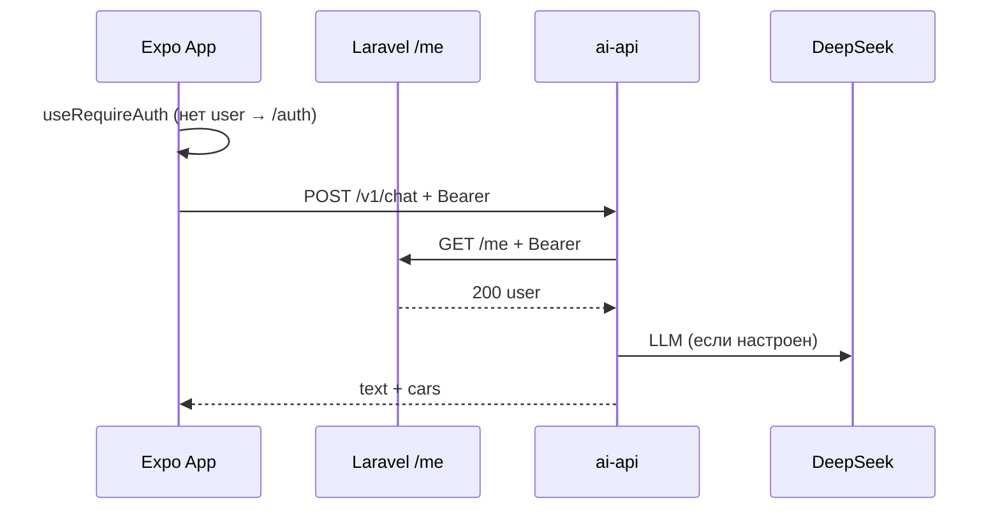

# Промпт: ИИ-подбор только для авторизованных пользователей

Скопируйте блок ниже в **новый чат Cursor (Agent)** с репозиторием `indep-rn`.

**Цель продукта:** неавторизованный пользователь **не может** открыть чат ИИ и слать запросы к `ai-api` (в т.ч. обойти UI прямым `curl`).

**Вне скоупа:** правки Laravel, CRM лидов, новый UI логина, деплой nginx/pm2.

---

## Контекст (для себя)

| Слой | Сейчас |
|------|--------|
| Маршрут | `src/app/ai-picker.tsx` → `AiPickerScreen` **без** проверки сессии |
| Меню | `src/shared/config/mainBurgerMenu.tsx` — пункт «Подбор новых авто с ИИ» виден всем |
| Паттерн в проекте | `useRequireAuth()` — экраны (`usePickerReportCreateController`); `useProtected().checkAuth()` — действия (`AutoScreen`) |
| Auth | `AuthContext` + `tokenStorage` + Laravel `GET /me` через `EXPO_PUBLIC_API_URL` |
| ai-api | `POST /v1/chat`, `POST /v1/leads` — **публичные**, только rate limit + опциональный client key |
| Риск | UI-гейт без сервера = любой знает URL и жжёт DeepSeek |

**Принцип сеньора:** защита **в два слоя** — UX на клиенте + **обязательная** проверка токена на `ai-api`.

---

## Текст промпта (копировать отсюда)

```
Ты — senior fullstack (React Native / Expo, TypeScript, Hono BFF). Сделай ИИ-подбор доступным **только авторизованным** пользователям. Работай в монорепо `indep-rn`. Минимальный diff, без переписывания auth-стека. Не меняй Laravel-код в другом репо — только вызов существующего `GET /me` (или эквивалент) для валидации Bearer-токена.

### Контекст — прочитай перед правками

**Клиент**
- `src/app/ai-picker.tsx` — тонкий route, сейчас без auth.
- `src/features/aiPicker/ui/AiPickerScreen.tsx` — экран чата.
- `src/features/aiPicker/hooks/useAiPickerBootstrap.ts`, `useAiPickerChat.ts`, `useAiPickerLead.ts` — RTK `aiPickerApi`.
- `src/features/aiPicker/api/aiPickerApi.ts` — `fetch` на `EXPO_PUBLIC_AI_API_URL` **без** `Authorization`.
- `src/hooks/useProtected.ts` — `useRequireAuth`, `useProtected().checkAuth`.
- `src/services/api/tokenStorage.ts` — access token после OTP/login.
- `src/shared/config/mainBurgerMenu.tsx` — пункт `ai-picker`.

**Сервер**
- `ai-api/src/routes/v1.ts` — `POST /v1/chat`, `POST /v1/leads`, `GET /v1/sites/:siteId/meta`, `GET /v1/sites/:siteId/catalog`.
- `ai-api/src/middleware/rateLimit.ts`, `clientKey.ts` — уже есть; не ломать.
- DeepSeek в `ai-api/.env` — не трогать секреты в git.

**Тесты:** `npm run typecheck`, `npm test`, `npm run typecheck --prefix ai-api`.

---

### Задача A — клиент (UX + передача токена)

#### A1. Защита экрана
- Оберни `AiPickerScreen` в gate с `useRequireAuth()` по аналогии с `usePickerReportCreateController`:
  - пока `loading` — спиннер/пустой экран (переиспользуй существующий `ScreenStateLoading` если уместно);
  - если `!user` — `router.replace("/(auth)")` (уже делает хук);
  - не монтируй чат и не дергай `aiPickerApi` до появления `user`.
- Альтернатива (если чище): логика gate в `src/app/ai-picker.tsx`, `AiPickerScreen` оставить презентационным.

#### A2. Пункт бургер-меню
- Для гостя: при тапе на «Подбор новых авто с ИИ» — `checkAuth()` → редирект на `/(auth)`, **не** открывать `/ai-picker`.
- Реализация: либо `onPress` в месте рендера меню (найди `BurgerMenu`), либо условный `href` + intercept — выбери минимальный diff в существующем паттерне.
- Опционально (если просто): скрывать пункт меню при `!user` — **дополнительно** к A1, не вместо.

#### A3. Authorization в aiPickerApi
- В `aiFetch` (`aiPickerApi.ts`): читать token из `tokenStorage.get()` (или существующий helper из `services/api`).
- Добавлять заголовок `Authorization: Bearer <token>` на все запросы к ai-api (`meta`, `catalog`, `chat`, `leads`).
- Если токена нет — не слать запрос, вернуть понятную ошибку («Войдите в аккаунт»).

#### A4. Ошибки 401/403 от ai-api
- В `useAiPickerChat` / `useAiPickerLead`: при 401 — сообщение «Войдите в аккаунт» + опционально `router.push("/(auth)")`.
- Не показывать generic `AI_PICKER_SERVER_UNAVAILABLE_MESSAGE` для 401.
- Добавь код ошибки в парсер `aiPickerApi` если нужно (`error.code === "unauthorized"`).

#### A5. Тесты клиента
- Тест: без `user` route/gate не рендерит чат (mock `useRequireAuth`).
- Тест: `aiFetch` добавляет `Authorization` когда token есть (mock `tokenStorage`).

---

### Задача B — ai-api (обязательная серверная защита)

#### B1. Middleware `requireUserAuth`
- Новый файл, например `ai-api/src/middleware/requireUserAuth.ts`.
- Читает `Authorization: Bearer <token>`.
- Если нет токена → **401** `{ "error": { "code": "unauthorized", "message": "Требуется авторизация" } }`.
- Валидирует токен **через backend**, не доверяя клиенту:
  - Env `AI_API_AUTH_ME_URL` — полный URL проверки, default: собрать из `AI_API_AUTH_API_BASE` + `/me` если задан base (документировать в `.env.example`).
  - Пример prod: `https://indep.su/api/v1.0/me` (уточни по `EXPO_PUBLIC_API_URL` в `.env.example` приложения).
  - `fetch(meUrl, { headers: { Authorization: Bearer ... }, signal: timeout })`.
  - HTTP 200 → пропустить запрос, опционально положить `userId` в Hono context.
  - 401/403/сеть/таймаут → 401 unauthorized (не 500, чтобы клиент различал).
- Env `AI_API_AUTH_REQUIRED=true` (default **true** в production, **false** в dev для локальной отладки без Laravel — через `NODE_ENV` или явный флаг).
- Кэшировать результат валидации **не обязательно** на MVP; если добавишь — in-memory TTL 30–60с по hash токена, без Redis.

#### B2. Куда вешать middleware
- **Обязательно:** `POST /v1/chat`, `POST /v1/leads`.
- **Рекомендуется:** `GET /v1/sites/:siteId/meta`, `GET /v1/sites/:siteId/catalog` — иначе гость всё ещё тянет каталог и может слать chat вручную; единая политика «весь v1 кроме health» проще.
- **Не трогать:** `GET /health` (мониторинг).

#### B3. Совместимость
- Rate limit и CORS — оставить как есть; порядок middleware: rate limit → auth → handler.
- React Native fetch часто **без Origin** — не требовать `X-AI-Client-Key` для мобилки (уже так в `clientKey.ts`).
- `AI_API_AUTH_REQUIRED=false` — только для локального `npm run dev` в ai-api; задокументировать.

#### B4. Тесты ai-api
- Unit-тест middleware с mock `fetch` на `/me`: нет header → 401; 200 → next; 401 от Laravel → 401.
- Интеграционный тест `v1`: `POST /v1/chat` без токена → 401 (при `AI_API_AUTH_REQUIRED=true`).

---

### Задача C — документация и env

- `ai-api/.env.example` — `AI_API_AUTH_REQUIRED`, `AI_API_AUTH_ME_URL` (или `AI_API_AUTH_API_BASE`).
- `ai-api/README.md` — короткая секция «Auth».
- `.env.example` (корень) — комментарий: ИИ требует login; `EXPO_PUBLIC_AI_API_URL` без изменений.
- `docs/DEMO.md` — обновить сценарий: «сначала логин, потом ИИ».

---

### Нефункциональные требования

- Не класть Laravel secret в `EXPO_PUBLIC_*`.
- Не отключать auth на prod «для демо» без явного env — default secure.
- Сообщения пользователю — по-русски, без технического жаргона.
- Diff: ориентир **< 400 строк**; не рефакторить весь aiPicker.

---

### Критерии приёмки (чеклист)

- [ ] Гость: тап по меню ИИ → экран авторизации, чат не открывается.
- [ ] Гость: прямой deep link `/ai-picker` → редирект на auth.
- [ ] Авторизованный: чат работает, машины и лиды как раньше.
- [ ] `curl POST /v1/chat` без Bearer → **401** (на staging/prod с `AI_API_AUTH_REQUIRED=true`).
- [ ] `curl` с валидным Bearer (токен с телефона после login) → 200.
- [ ] `npm run typecheck` + `npm test` зелёные.

---

### Формат отчёта агента

1. Что сделано (клиент / сервер / env).
2. Таблица новых env-переменных.
3. Как проверить вручную (3 curl + сценарий в Expo).
4. Ограничения MVP (токен в APK можно извлечь — auth не заменяет rate limit; нужен Laravel uptime для `/me`).

### Явно не делать

- Не вводить отдельную регистрацию «для ИИ».
- Не хранить пользователей в ai-api.
- Не пушить `.env` с ключами.
- Не ломать офлайн fallback `EXPO_PUBLIC_AI_API_FALLBACK_LOCAL` без auth — если fallback включён, документировать что он **только dev** и тоже должен требовать `user` на клиенте.
```

---

## Краткая схема (для ревью)



---

## После мержа (деплой)

На VPS в `ai-api/.env` добавить:

```env
AI_API_AUTH_REQUIRED=true
AI_API_AUTH_ME_URL=https://indep.su/api/v1.0/me
```

Перезапуск с `source .env` (как сейчас на `ai-api.n-avtosalon.ru`).

---

## Связанные файлы

| Файл | Роль |
|------|------|
| `src/app/ai-picker.tsx` | Route |
| `src/hooks/useProtected.ts` | Готовые хуки |
| `src/features/aiPicker/api/aiPickerApi.ts` | Добавить Bearer |
| `ai-api/src/routes/v1.ts` | Подключить middleware |
| `src/services/authService.ts` | Контракт `/me` |
