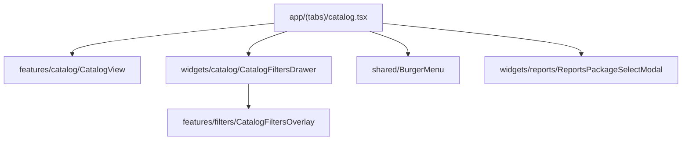

# Промпт: композиция каталога в `app/(tabs)/catalog.tsx`

Скопируйте блок ниже в **новый чат Cursor (Agent)** с репозиторием `indep-rn`.

Связано с: архитектурное ревью **P1** — `CatalogScreen` нарушает FSD (feature → widget, page-level оркестрация внутри feature).

---

## Что это за проблема (для себя)

`src/features/catalog/ui/CatalogScreen.tsx` (~255 строк) сейчас = **целая страница таба**, а не feature:

| Что смешано в `CatalogScreen` | Где должно жить по FSD |
|------------------------------|------------------------|
| `BurgerMenu`, logout | `app/(tabs)/catalog.tsx` (как в `index.tsx`) |
| `ReportsPackageSelectModal` | `app` или widget, не feature catalog |
| Slide-in overlay + анимация фильтров | `app` или `widgets/catalog` shell |
| `CatalogFiltersOverlay` из `features/filters` | композиция в `app` (feature не импортирует соседнюю feature) |
| Список, сортировка, хуки каталога | `features/catalog` |

`src/app/(tabs)/catalog.tsx` — пустая обёртка `<CatalogScreen />`. На главной (`index.tsx`) композиция **уже в app**: burger, `ReportsPackageSelectModal`, виджеты home.

Итог: архитектурный долг, не runtime-баг. UX и поведение должны остаться **1:1**.

---

## Текст промпта (копировать отсюда)

```
Ты — senior React Native / TypeScript-разработчик. Исправь FSD-композицию каталога: вынеси page-level UI из `features/catalog/ui/CatalogScreen.tsx` в `app/(tabs)/catalog.tsx` по паттерну `app/(tabs)/index.tsx`. Работай минимальным diff. Чистый рефакторинг — не меняй дизайн, не подключай backend для callback, не добавляй фичи.

### Контекст (прочитай перед правками)

**Эталон композиции:** `src/app/(tabs)/index.tsx`
- `BurgerMenu` + `getMainBurgerMenuItems(user?.role)` + `MainBurgerMenuFooter`
- `ReportsPackageSelectModal` + `useReportsPackagePurchaseModal`
- Виджеты home собираются в роуте, не внутри feature

**Проблемный файл:** `src/features/catalog/ui/CatalogScreen.tsx`
Импорты, которые **не должны** остаться в feature после рефакторинга:
- `widgets/reports/ReportsPackageSelectModal`, `useReportsPackagePurchaseModal`
- `shared/ui/BurgerMenu` + `shared/config/mainBurgerMenu` (page chrome)
- `features/filters/ui/CatalogFiltersOverlay`, `buildCatalogFiltersOverlayProps`
- Анимация slide-in панели фильтров (`Animated`, backdrop, `filtersOpen` state)

**Пустой роут:** `src/app/(tabs)/catalog.tsx` — только `<CatalogScreen />`.

**Что остаётся зоной каталога (feature):**
- `useCatalogCars`, `useCatalogFiltersController`
- `CatalogHeaderSection`, `CatalogContentSection`, `CatalogSortDropdown`, `CatalogCarsList`, стили
- `CatalogCallbackRequestModal` — допустимо оставить в feature (каталог-специфичный CTA), **или** вынести в app если проще; не удалять
- `handleCallbackSubmit` placeholder (setTimeout 500ms) — **не трогать**, не подключать API

**Связанные файлы filters (не ломать):**
- `src/features/filters/ui/CatalogFiltersOverlay.tsx` — safe area, секции, bottom panel
- `src/features/filters/ui/CarSearchFiltersBottomPanel.tsx`
- `buildCatalogFiltersOverlayProps` в `features/filters/ui/catalogFilters/`

**Тесты (должны остаться зелёными):**
- `src/features/catalog/hooks/__tests__/useCatalogCars.test.tsx`
- `src/features/catalog/hooks/__tests__/useCatalogFiltersController.test.tsx`
- `src/features/catalog/hooks/__tests__/useCatalogFiltersController.test.tsx` и прочие — полный `npm test`

Отдельных тестов на `CatalogScreen` нет — не обязательно добавлять в этом PR.

### Цели (обязательно)

#### 1. `app/(tabs)/catalog.tsx` — page composer (как `index.tsx`)

Перенести в роут и собрать там:
- state: `menuOpen`, `filtersOpen`, `callbackModalOpen`
- `useAuth` → burger items + logout
- `useReportsPackagePurchaseModal` + `ReportsPackageSelectModal`
- `BurgerMenu`
- Shell фильтров: backdrop + `Animated` slide panel + `CatalogFiltersOverlay` с `buildCatalogFiltersOverlayProps(controller, closeFilters)`
- Рендер «тела» каталога из feature

Роут может использовать хуки каталога (`useCatalogCars`, `useCatalogFiltersController`) **или** тонкий хук-обёртку `useCatalogPageState` в `features/catalog/hooks/` — на твоё усмотрение, но **без** widget-импортов внутри feature hooks.

#### 2. Упростить `features/catalog` — без widget / cross-feature imports

После рефакторинга `CatalogScreen` (или переименуй в `CatalogView` / `CatalogBody` — опционально) **не импортирует**:
- `widgets/*`
- `features/filters/*`
- `BurgerMenu`, `mainBurgerMenu`

Принимает через props (controlled / callbacks), например:
- `onOpenBurger`, `onBuyReport`, `onOpenFilters`, `onOpenCallbackRequest`
- `openFilters` / `filtersOpen` — либо callback «открыть фильтры» из content section, либо controlled снаружи
- данные: `cars`, `loading`, `errors`, `controller` fields, `favorites`, handlers навигации

Feature отвечает за:
- layout каталога (header, content, sort dropdown positioning)
- sort anchor / `CatalogSortDropdown` (это UX каталога, может остаться в feature)
- **не** за burger, reports package modal, filters slide shell

#### 3. Shell фильтров — отдельный компонент (рекомендуется)

Вынести overlay-оболочку (backdrop + `Animated.View` + children) в один из вариантов:
- **Предпочтительно:** `src/widgets/catalog/CatalogFiltersDrawer.tsx` (принимает `open`, `onClose`, `children`)
- **Альтернатива:** `src/features/filters/ui/CatalogFiltersDrawer.tsx` — только если app импортирует filters feature напрямую (допустимо в app-слое)

`CatalogFiltersOverlay` остаётся в `features/filters` — drawer только оборачивает анимацию, не дублирует секции фильтров.

Сохранить поведение 1:1:
- slide слева 300ms
- backdrop закрывает по tap
- при открытых фильтрах sort dropdown не показывается (как сейчас `sortOpen && !filtersOpen`)

#### 4. Согласованность с `index.tsx`

Паттерн burger + reports modal в каталоге должен **читаться так же**, как на главной:
- те же `getMainBurgerMenuItems(user?.role)`
- тот же `useReportsPackagePurchaseModal`
- `onBuyReport={reportsPackageModal.open}` в content section

Не дублировать логику в shared hook **только если** diff остаётся маленьким; опционально `usePageChromeModals()` — не обязательно в MVP.

### Правила рефакторинга

1. **Поведение и UI 1:1** — фильтры, сортировка, избранное, переход на `/auto/:id`, logo → `/(tabs)`, safe area, Dynamic Island padding в фильтрах.
2. **Минимальный diff** — не рефакторить `AutoCreditScreen`, `PickerProfileSection`, другие экраны.
3. **FSD imports:**
   - `app` → может импортировать `features/*`, `widgets/*`, `shared/*`, `contexts/*`
   - `features/catalog` → только `shared`, `contexts`, `entities`, внутренние модули catalog; **не** `widgets`, **не** `features/filters`
4. **Не менять** публичные API хуков `useCatalogCars` / `useCatalogFiltersController` без необходимости.
5. **Не коммитить** без явной просьбы пользователя.

### Проверки (обязательно выполнить)

```bash
npm run typecheck
npm test -- src/features/catalog/hooks
npm test
```

Ручной smoke (описать в отчёте):
- [ ] Таб «Каталог» открывается
- [ ] Burger menu открывается, logout работает
- [ ] Фильтры slide-in / close backdrop
- [ ] Сортировка dropdown позиционируется у кнопки
- [ ] «Купить отчёт» открывает `ReportsPackageSelectModal`
- [ ] Карточка авто → `/auto/:id`
- [ ] Callback modal открывается (submit по-прежнему placeholder)

### Формат отчёта

- Таблица: что перенесено из `CatalogScreen` → куда
- Список изменённых файлов
- До/после: импорты в `features/catalog` (должно быть 0 `widgets/` и 0 `features/filters/`)
- Результат `typecheck` + `npm test` (passed/total)
- Что **намеренно не** сделано (callback backend, общий hook с index, тесты CatalogScreen)

### Ограничения

- Не трогать `features/filters` секции/логику фильтров — только композиция и shell.
- Не менять tab layout `app/(tabs)/_layout.tsx`.
- Не подключать API для `CatalogCallbackRequestModal`.
- Не «улучшать» каталог (новые фильтры, RTK, redesign).
```

---

## Короткая версия

```txt
Вынеси page-level композицию из features/catalog/ui/CatalogScreen.tsx в app/(tabs)/catalog.tsx по паттерну index.tsx: BurgerMenu, ReportsPackageSelectModal, slide-in shell фильтров + CatalogFiltersOverlay. Feature catalog — только список/сортировка/хуки, без imports widgets/* и features/filters/*. Опционально widgets/catalog/CatalogFiltersDrawer.tsx. UX 1:1, useCatalogCars/useCatalogFiltersController тесты + npm test зелёные. Без callback API и без коммита.
```

---

## Целевая структура (после)

```
app/(tabs)/catalog.tsx          # composer: burger, modals, filters drawer, wires CatalogView
features/catalog/
  ui/CatalogView.tsx            # slim: header, content, sort (no widgets/filters imports)
  hooks/useCatalogCars.ts       # без изменений по смыслу
  hooks/useCatalogFiltersController.ts
widgets/catalog/
  CatalogFiltersDrawer.tsx      # backdrop + Animated panel (optional but recommended)
features/filters/
  ui/CatalogFiltersOverlay.tsx  # без изменений по смыслу
```



---

## Чеклист после выполнения агента

- [ ] `grep widgets/ src/features/catalog` — пусто
- [ ] `grep features/filters src/features/catalog` — пусто
- [ ] `catalog.tsx` > 20 строк (реальная композиция, не обёртка)
- [ ] `CatalogScreen`/`CatalogView` < ~180 строк
- [ ] Фильтры: анимация и safe area как до рефакторинга
- [ ] `npm run typecheck` OK
- [ ] `npm test` — все passed

---

## Связь с аудитом

| Пункт | Суть |
|-------|------|
| **P1 FSD** | Feature catalog импортирует widgets + filters |
| **Consistency** | `index.tsx` composes in app, catalog — исключение |
| **Testability** | Feature можно тестировать без burger/reports modal mocks |

После этого промпта логичный follow-up: тот же паттерн для `AutoCreditScreen` / других «толстых» feature-screens — отдельным промптом.
