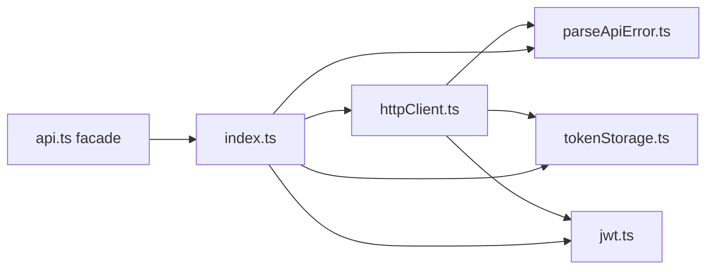

# Промпт: разбить god module `api.ts`

Скопируйте блок ниже в **новый чат Cursor (Agent)** с репозиторием `indep-rn`.

Связано с: архитектурное ревью **P1** (god module ~700 строк: tokens + fetch + JWT + error parsing в одном файле).

---

## Что это за проблема (для себя)

`src/services/api.ts` (~774 строки) смешивает:

| Зона ответственности | Примеры в файле |
|----------------------|-----------------|
| Хранение токенов | `tokenStorage`, `refreshTokenStorage`, SecureStore/AsyncStorage, migration, telemetry |
| JWT | `decodeJwtPayload`, `getTokenExp`, `isTokenExpired` |
| HTTP-клиент | `fetch`, retry/backoff, timeout/abort, 401 refresh, `api.get/post/...` |
| Парсинг ошибок | `ApiError`, `classifyApiError*`, `parseErrorPayload`, envelope `{ error }` |

Итог: сложно тестировать изолированно, высокий coupling, любое изменение auth/storage трогает transport layer.

Цель — **разделить по SRP**, сохранив **публичный API** и **поведение 1:1** (рефакторинг без фич).

---

## Текст промпта (копировать отсюда)

```
Ты — senior TypeScript-разработчик. Разбей god module `src/services/api.ts` на отдельные модули: **parseApiError**, **tokenStorage**, **httpClient** (+ внутренний **jwt**). Работай минимальным diff. Это чистый рефакторинг — не меняй контракт с Laravel, не добавляй фичи.

### Контекст (прочитай перед правками)

**Текущий монолит** `src/services/api.ts`:
- Base URL: `resolveBaseUrl` / `getBaseUrl`, кэш, `resetApiBaseUrlCacheForTests`
- Env: `EXPO_PUBLIC_API_URL`, `EXPO_PUBLIC_ALLOW_HTTP_DEV`, `EXPO_PUBLIC_API_TIMEOUT_MS`, `EXPO_PUBLIC_ALLOW_INSECURE_TOKEN_STORAGE`
- Ошибки: `ApiError`, `ApiErrorCode`, `classifyApiError`, `classifyApiErrorByStatus`, `classifyApiErrorByContractCode`, `parseErrorMessage`, `parseErrorPayload`
- Storage: `tokenStorage`, `refreshTokenStorage`, legacy keys, in-memory cache, SecureStore → AsyncStorage fallback, `reportTelemetry("token_storage_failure")`
- JWT: `decodeJwtPayload`, `getTokenExp`, `isTokenExpired` (opaque Sanctum `api_token` не считается expired)
- HTTP: `request` / `requestOnce`, retry GET на network/502/503/504, dedup refresh на 401, `setUnauthorizedHandler` / `setRefreshHandler`, unwrap `{ data }`, `normalizeApiPath` (/v1)
- Публичный экспорт: `api`, `ApiError`, `classifyApiError`, `tokenStorage`, `refreshTokenStorage`, `decodeJwtPayload`, `getTokenExp`, `isTokenExpired`, `setUnauthorizedHandler`, `setRefreshHandler`, `resetApiBaseUrlCacheForTests`

**Потребители (не ломать импорты):**
- `src/services/authService.ts` — `ApiError`, `api`, `tokenStorage`, `refreshTokenStorage`
- `src/contexts/AuthContext.tsx` — `tokenStorage`, `refreshTokenStorage`, `setRefreshHandler`, `setUnauthorizedHandler`
- `src/services/carService.ts`, `favoritesService.ts`, `clientReportsService.ts`, `pickerReportsService.ts` — `api`, `ApiError`, `classifyApiError`
- `src/services/reportServiceShared.ts` — `ApiError`, `classifyApiError`
- `src/shared/monitoring/sentry.ts` — `ApiError`
- Тесты: `src/services/__tests__/api.test.ts` (22 кейса), `src/services/__tests__/authService.test.ts` (мокает `../api`)

### Целевая структура

```
src/services/api/
  parseApiError.ts    # типы и парсинг ошибок API
  tokenStorage.ts     # access + refresh storage (включая migration/telemetry)
  jwt.ts              # decode/expiry (внутренний для httpClient; экспортировать как сейчас)
  httpClient.ts       # fetch, retry, handlers, api object, base URL
  index.ts            # barrel: реэкспорт всего публичного API
```

`src/services/api.ts` — **тонкий re-export** (одна строка), чтобы все существующие `from "./api"` и `from "../services/api"` работали без правок:

```ts
export * from "./api/index";
```

(Если barrel в `api/index.ts` конфликтует с путём `api.ts` в резолвере — оставь только `api.ts` как facade или переименуй папку в `apiClient/`; главное — **ноль изменений** в `authService`, `AuthContext`, сервисах.)

### Разделение ответственности (обязательно)

#### 1. `parseApiError.ts`
Перенести:
- `ApiError` class, `ApiErrorCode`
- `classifyApiErrorByStatus`, `classifyApiErrorByContractCode`, `classifyApiError`
- `parseErrorMessage`, `parseErrorPayload` (сейчас private — экспортировать **только если** нужно для тестов; иначе оставить module-private)

**Не** импортировать `tokenStorage`, `fetch`, SecureStore.

#### 2. `tokenStorage.ts`
Перенести:
- `tokenStorage`, `refreshTokenStorage`
- `TOKEN_KEY`, `REFRESH_TOKEN_KEY`, legacy keys, in-memory cache
- `getSecureItemWithMigration`, `getAsyncItemWithMigration`
- `allowInsecureAsyncTokenStorage`, storage telemetry helpers

**Не** импортировать `httpClient` / `api` (избежать circular deps).

#### 3. `jwt.ts`
Перенести:
- `decodeBase64Url` (private), `decodeJwtPayload`, `getTokenExp`, `isTokenExpired`, `isJwtShapedToken`

Используется `httpClient` для pre-refresh перед запросом. Экспортировать из barrel — как сейчас (тесты импортируют `isTokenExpired`).

#### 4. `httpClient.ts`
Перенести:
- `resolveBaseUrl`, `getBaseUrl`, `resetApiBaseUrlCacheForTests`, `getRequestTimeoutMs`
- `setUnauthorizedHandler`, `setRefreshHandler`, dedup tasks
- `normalizeApiPath`, `request`, `requestOnce`, `api` object
- retry/backoff, abort/timeout, 401 refresh flow, envelope unwrap `{ data }`

Импорты:
- `./parseApiError` — `ApiError`, классификаторы
- `./tokenStorage` — `tokenStorage`, `refreshTokenStorage`
- `./jwt` — `isTokenExpired`

**Не** дублировать логику ошибок/storage — только orchestration.

### Правила рефакторинга

1. **Поведение 1:1** — все 22 теста в `api.test.ts` и 31+ в `authService.test.ts` должны проходить без изменения assert'ов (допустимо менять только пути импорта внутри тестов, если barrel сохранён).
2. **Минимальный diff** — не трогать `authService`, `carService`, `AuthContext` и др., если barrel `api.ts` реэкспортирует всё.
3. **Без circular imports** — граф: `parseApiError` ← `jwt` ← `tokenStorage` (независим) ← `httpClient` ← `index`.
4. **Не менять** сигнатуры публичных функций/объектов (`api.get/post`, `tokenStorage.get/set/clear`, `ApiError` constructor fields).
5. **Не добавлять** новые env, зависимости, DI-фреймворки.
6. Комментарии на русском в storage/http — сохранить тон и смысл существующих, не раздувать.

### Тесты

- `src/services/__tests__/api.test.ts` — **оставить** как integration-тесты httpClient+storage; путь импорта `from "../api"` или `from "../api/index"` — на твоё усмотрение, но тесты не переписывать под новую семантику.
- Опционально (только если diff остаётся маленьким): 2–3 unit-теста на `parseApiError` (envelope `RATE_LIMITED`, legacy `{ message }`, fallback HTTP status) в `src/services/api/__tests__/parseApiError.test.ts`. **Не обязательно** для MVP этого рефакторинга.
- `authService.test.ts` — не трогать, кроме случая сломанного jest mock path.

### Проверки (обязательно выполнить)

```bash
npm run typecheck
npm test -- src/services/__tests__/api.test.ts
npm test -- src/services/__tests__/authService.test.ts
npm test
```

### Формат отчёта

- Таблица: старый блок в `api.ts` → новый файл
- Список изменённых файлов
- Подтверждение: circular deps нет, публичные импорты потребителей не менялись (или перечисли исключения)
- Результат команд typecheck + test (количество passed)
- Что **намеренно не** вынесено (например, `aiPickerApi` — другой API, вне скоупа)

### Ограничения

- Не трогать `ai-api/`, Laravel, `features/aiPicker/api/*`.
- Не менять формат запросов/ответов к `https://indep.su/api/v1.0`.
- Не делать «улучшений» (новый retry policy, другой storage, axios) — только split.
- Не коммитить без явной просьбы пользователя.
```

---

## Короткая версия

```txt
Разбей src/services/api.ts (~700 строк) на src/services/api/: parseApiError.ts (ApiError, classify, parse envelope), tokenStorage.ts (access+refresh, SecureStore migration), jwt.ts (decode/expiry), httpClient.ts (fetch, retry, 401 refresh, api object). Оставь src/services/api.ts как export * from "./api/index" — ноль правок в authService/AuthContext/сервисах. Поведение 1:1, api.test.ts + authService.test.ts + npm test зелёные. Без фич и без circular deps.
```

---

## Ожидаемый граф зависимостей



---

## Чеклист после выполнения агента

- [ ] `wc -l src/services/api.ts` — facade ≤ 5 строк
- [ ] Нет `fetch` / `SecureStore` в `parseApiError.ts`
- [ ] Нет импорта `httpClient` из `tokenStorage.ts`
- [ ] `api.test.ts` — 22/22 passed
- [ ] `authService.test.ts` — все passed
- [ ] `npm run typecheck` — без ошибок
- [ ] Grep `from "./api"` по `src/` — потребители без изменений (или только тесты)

---

## Связь с аудитом

| Пункт | Суть |
|-------|------|
| **P1 god module** | `api.ts` смешивает transport, persistence и error domain |
| **Тестируемость** | Изолированный `parseApiError` упрощает contract-тесты envelope |
| **Следующий шаг** | После split — staging contract test auth (`docs/FIX-AUTH-STAGING-CONTRACT-PROMPT.md`) |
